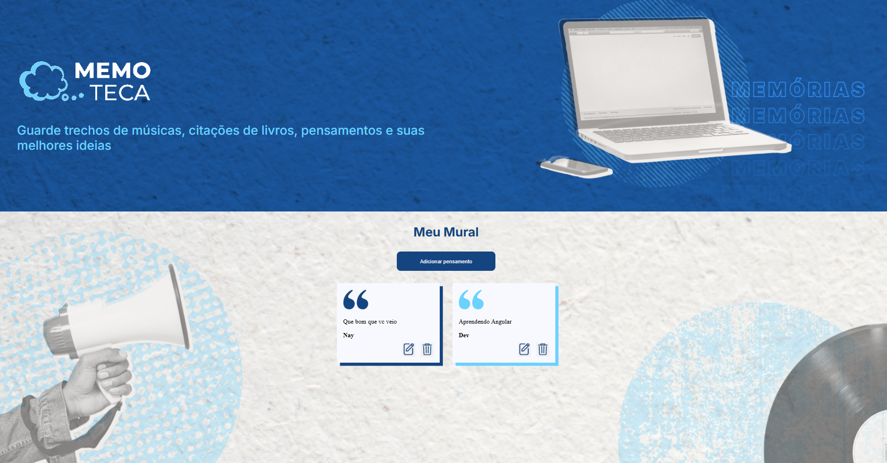

# Memoteca

## ℹ️ Sobre

Projeto utilizado no curso para aprendizado das técnicas e melhores práticas.

## 📘Ementa

### Angular 14: aplique os conceitos e desenvolva seu primeiro CRUD

- Utilizar a ferramenta Angular CLI para criar um projeto e diversos tipos de arquivos
- Entender a estrutura de um componente em Angular
- Aprender como usar property binding, interpolação, event binding e two-way data binding
- Conhecer algumas das principais diretivas do Angular
- Adicionar navegação dinâmica entre componentes através das rotas
- Aplicar injeção de dependências na aplicação
- Realizar requisições HTTP através da classe HttpClient e desenvolva um CRUD

## 🖥️ Tecnologias

  
  
  

## 🧑‍🏫 Instrutor(es)

| [ Nayanne Batista](https://github.com/nayannelbatista) |
| :------------------------------------------------------------------------------------------------------------------------------------------------------------: |

## 💻 Screenshot

